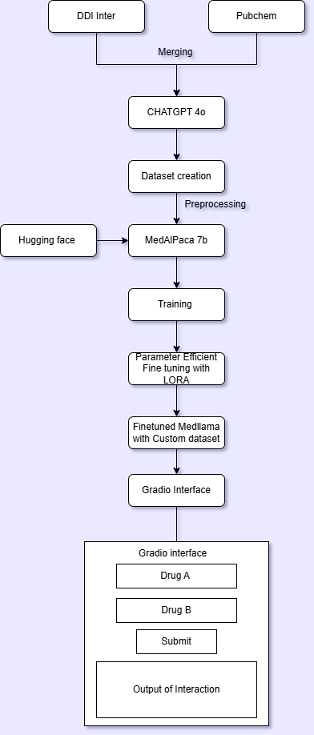

# Enhancing Pharmacovigilance: Predicting Adverse Drug Interactions Using MedAlpaca (LLaMA-7B)

**Term:** Spring 2025  
**Team:** Team Green  
**Advisor:** Prof. Div Pithadia | Department: ECECS | Tagliatela College of Engineering

---

## 👩‍🎓 Students
- Yash Raythatha
- Ayushi Jar
- Saurabh
- Ayush Prajapati

---

## #️⃣ Keywords
MLOps, Python, Fine-tuning, Drug Interaction Prediction, Healthcare AI, Google Colab, MedAlpaca, Hugging Face, Gradio, LoRA, 4-bit Quantization

---

## 💻 Project Abstract
Drug interactions are a major cause of hospitalizations and adverse health outcomes. Current tools often lack accessibility and interpretability. This project bridges the gap using data science combined with clinical knowledge and large language models (LLMs).

We developed an AI-powered model to predict potential side effects caused by commonly prescribed drug combinations and generate clinically relevant, human-understandable summaries using a fine-tuned MedAlpaca (LLaMA 7B) model.

---

## 🫧 Background
Clinical decision-making tools that assess drug-drug interactions often provide limited or overly technical outputs. Our goal was to enhance accessibility and clinical relevance by developing an AI-driven platform capable of offering reliable, easy-to-interpret interaction information using modern machine learning methods.

---

## 📋 High-Level Requirements
- Develop a machine learning model capable of predicting and explaining drug-drug interactions.
- Fine-tune a large language model (LLaMA-7B) with curated datasets.
- Build a user-friendly Gradio-based web interface for clinicians and researchers.
- Deploy a publicly accessible version for broader testing and feedback.

---

## 📋 Functional Requirements
- Merge and preprocess multiple datasets related to drug-drug interactions.
- Fine-tune MedAlpaca 7B model using expanded dataset with LoRA and 4-bit quantization.
- Develop a Gradio-based web application for users to input drug pairs.
- Provide human-readable interaction descriptions, mechanisms, and severity levels.

---

## ✅ Non-Functional Requirements
- The system must be cloud deployable.
- Model inference must be GPU-optimized using 4-bit quantization.
- Web interface should be responsive and mobile-accessible.
- Secure API for future integration with EHR (Electronic Health Record) systems.

---

## ✨ Key Features
- **Interactive UI**: Easy-to-use Gradio interface for clinicians and researchers.
- **Clinical-Grade Predictions**: Human-readable interaction descriptions generated from fine-tuned MedAlpaca model.
- **Interaction Management Tips**: Output provides actionable advice (e.g., dose adjustments, alternatives, and monitoring needs).

---

## 📊 Data Sources
- [DDI Corpus](https://ddinter.scbdd.com/)
- [PubChem](https://pubchem.ncbi.nlm.nih.gov/)
- [Drugs.com](https://www.drugs.com/)
- ChatGPT-4.0 for data expansion and instruction formatting

---

## ✍🏼 Conceptual Design
The project pipeline is as follows:
- Merge data from DDI Inter and PubChem.
- Expand the dataset using LLM.
- Preprocess and curate high-quality human-readable side effect data.
- Fine-tune the MedAlpaca-7B model using LoRA for parameter-efficient training.
- Deploy using a Gradio interface for user interaction.

All modeling, training, and experimentation were conducted using **Google Colab**.

<div align="center">
  
</div>

---

## 🛠️ Technical Design
- **Base Model:** `medalpaca/medalpaca-7b`
- **Fine-tuning Strategy:** LoRA (Low-Rank Adaptation), 4-bit quantization (NF4)
- **Training Frameworks:** Hugging Face Transformers, PEFT, Accelerate, BitsAndBytes
- **Interface:** Gradio
- **Deployment:** Hugging Face Spaces or local server

---

## 📄 Dataset Format

Training data followed instruction-output format (JSONL):

```json
{
  "instruction": "Analyze the interaction between aspirin and warfarin.",
  "output": "Both drugs may increase the risk of bleeding. Monitor for signs of bruising or unusual bleeding."
}
```

---

## 📦 Required Resources
- Google Colab with GPU (Pro preferred)
- PyTorch (with CUDA support)
- Hugging Face Transformers, PEFT, Accelerate, BitsAndBytes
- Gradio for web interface
- Jupyter for experimentation and preprocessing

---

## 🏁 Project Plan & Milestones

| Week | Milestone/Activity | Deliverables/Features |
|:----|:--------------------|:----------------------|
| 1    | Define Scope and Requirements | Finalized project scope and high-level objectives |
| 2    | Dataset Collection | Sourced DDI Inter and PubChem datasets |
| 3    | Dataset Merging | Merged datasets and initial validation |
| 4    | Dataset Expansion | Used ChatGPT-4.0 for side effect generation |
| 5    | Preprocessing | Cleaned and structured expanded dataset |
| 6    | Model Setup | Prepared MedAlpaca base model on Colab |
| 7    | Fine-tuning Strategy Finalization | Integrated LoRA + 4-bit quantization |
| 8    | Fine-tuning Model | Trained model on dataset |
| 9    | Evaluation | Checked perplexity, consistency |
| 10   | UI Development | Built Gradio interface |
| 11   | Testing | Integrated and tested end-to-end system |
| 12   | Final Deployment | Hugging Face Spaces / Gradio |

---

## 🧪 Test Cases
- Verified output for a wide range of drug pairs
- Assessed medical soundness of interaction warnings
- Monitored consistency of explanation format
- Conducted EDA on prediction distribution
- Ran interface load tests with simulated users

---

## 👩🏻‍🏫 Installation Instructions

### ⚙️ Environment Requirements

- Python ≥ 3.9
- CUDA-enabled GPU (for fine-tuning)
- Google Colab runtime with GPU enabled:

```text
Runtime > Change runtime type > GPU
```

### Install Dependencies

```bash
pip install -r requirements.txt
```

---

## 💡 Tips for Best Usage
- Prefer Colab Pro+ or dedicated GPU VM for training
- Use clear, generic drug names (e.g., "aspirin", "warfarin")
- Always cross-reference with certified drug interaction sources
- Expand model with more examples for multilingual or rare drugs if needed

---

### 👩🏻‍💻🧑🏻‍💻 Collaborators

<table>
<tr>
    <td align="center">
        <a href="https://github.com/digitaldiv">
            
            <br />
            <sub><b>Div Pithadia</b></sub>
        </a>
    </td>
    <td align="center">
        <a href="https://github.com/chargershub">
            
            <br />
            <sub><b>Chargers Hub</b></sub>
        </a>
    </td></tr>
</table>
